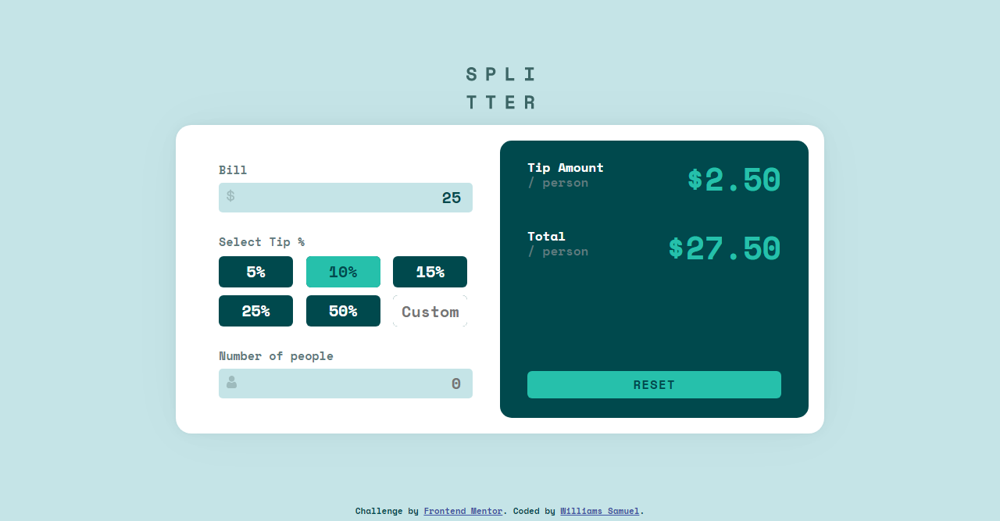

# Frontend Mentor - Tip calculator app solution

This is a solution to the [Tip calculator app challenge on Frontend Mentor](https://www.frontendmentor.io/challenges/tip-calculator-app-ugJNGbJUX). Frontend Mentor challenges help you improve your coding skills by building realistic projects.

## Table of contents

-   [Screenshot](#screenshot)
-   [Links](#links)
-   [Built with](#built-with)

### Screenshot

### Links

-   Solution URL: [Frontend Page](https://www.frontendmentor.io/solutions/tip-converter-with-sass-and-vanilla-js-KeObRnHnJ)
-   Live Site URL: [Tip Calculator](https://williamssam.github.io/tip-calculator)

### Built with

-   Semantic HTML5 markup
-   CSS custom properties
-   Flexbox
-   CSS Grid
-   Vanilla JS
